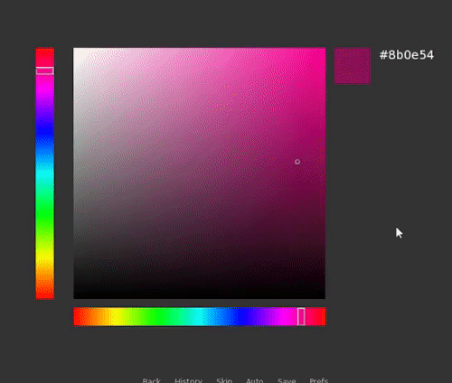

# renpy-color-picker
A simple color picker for Ren'Py.

## How to Use

1. Download the ZIP of this repository using the green button in the top right. The two main files you will need are `color_picker.rpy` and `selector.webp`. 
2. Put `color_picker.rpy` inside your Ren'Py project folder (with your other `rpy` files). Put `selector.webp` inside the `images` folder.
    1. Note: you may replace `selector.webp` with your own image. The program requires an image named `selector`, but you can redeclare it in the script or by replacing the provided image.
3. There is a test label, `label how_to_use_color_picker`, included in `color_picker.rpy`. You can jump to it to test out the color picker (e.g. `jump how_to_use_color_picker`).

In particular, the example screen `screen color_picker` should be used as a guide for adding the picker to your own screens. The picker, hue bars, preview swatch, hex code information, etc. are all separate screen elements and can be resized and moved around the screen however you like. 

## Terms of Use

You are free to use this code however you wish. Credit as `Feniks` is not required but is appreciated if you found the code useful. You can also check out my website, https://feniksdev.com/ for Ren'Py coding tutorials.

## Like my work?

